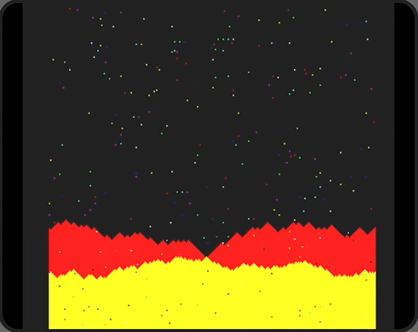

# Parallax on ASIC

This is a small experimental ASIC project that renders procedural 2D scrolling terrain with stars using LFSRs and generates VGA 640x480@72Hz signal.

This experiment is a part of multi project submission to the [Google/Efabless/Skywater shuttle](https://efabless.com/open_shuttle_program/3).

The code is base upon the following FPGA examples:
* [Matt's VGA Clock repo](https://github.com/mattvenn/vga-clock)
* [Will Green's Project F](https://projectf.io/sitemap/#fpga-graphics)
* [Steven Hugg's FPGA examples for 8bitworkshop.com](https://github.com/sehugg/fpga-examples)
* [Juan Manuel Rico VGA signal synchronisation](https://github.com/adumont/fpga-font/blob/master/vga_sync.v)

Hopefully it looks something like this once ASIC has been taped out:

# License

This project is [licensed under Apache 2](LICENSE)
